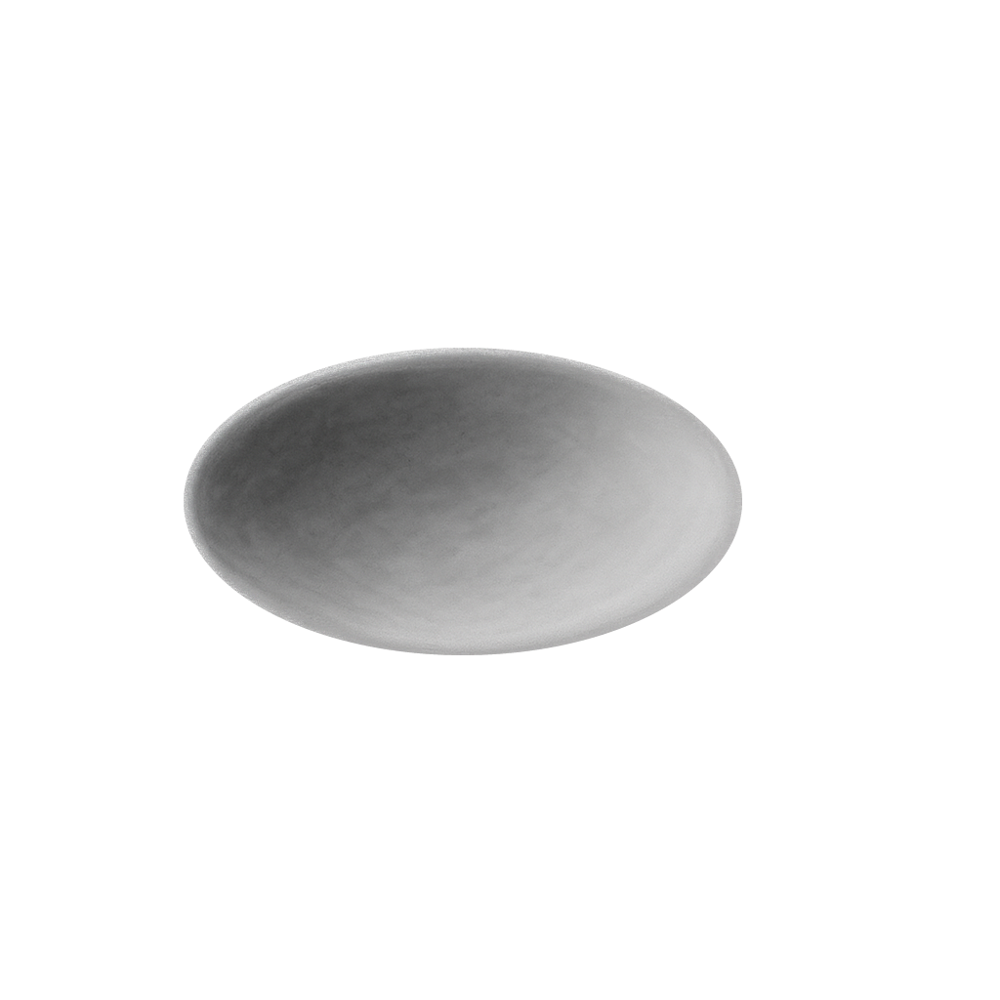
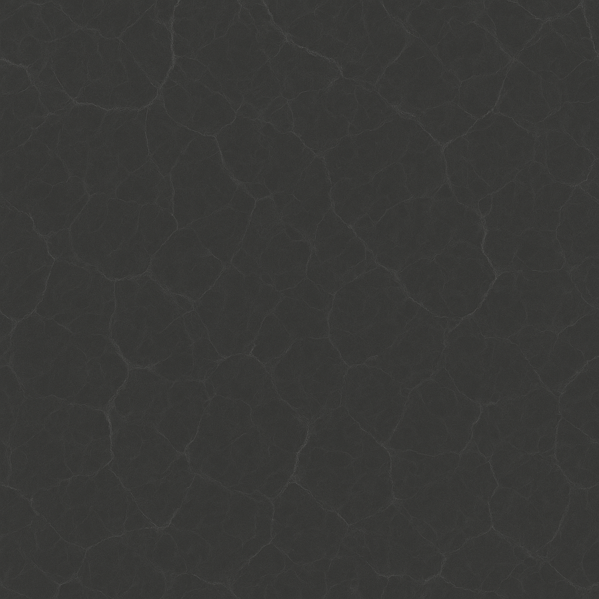
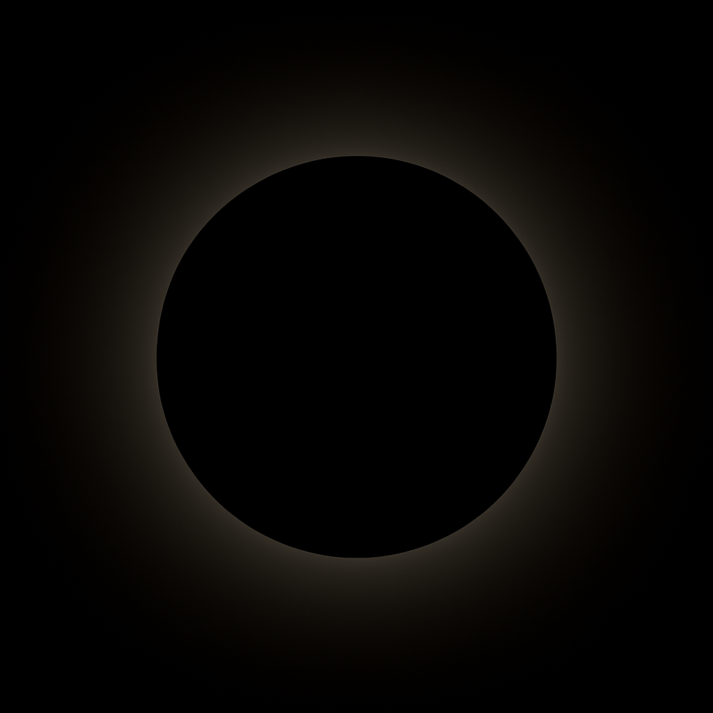
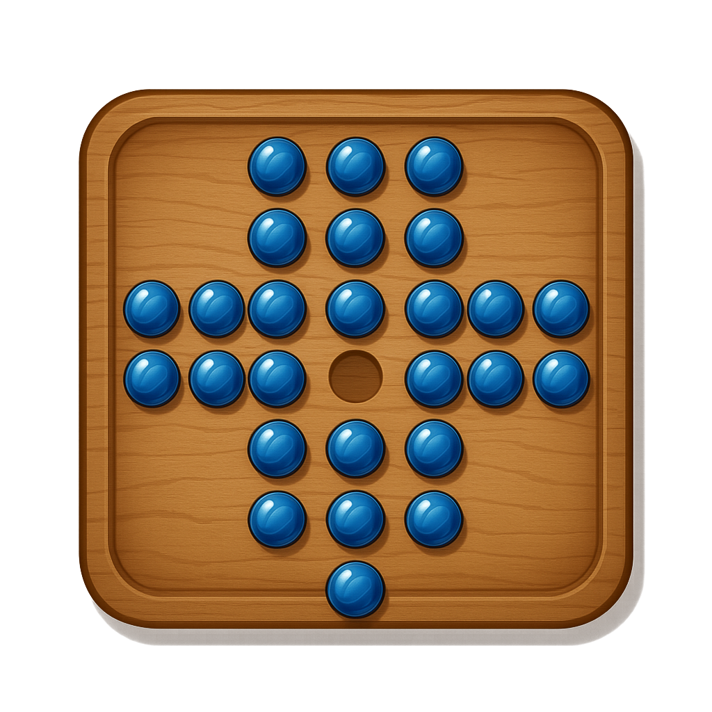

:toc: macro
:icons: font

ifdef::env-github[]
:tip-caption: :bulb:
:note-caption: :information_source:
:important-caption: :heavy_exclamation_mark:
:caution-caption: :fire:
:warning-caption: :warning:
endif::[]

= Peg Solitaire
Matt Bergstrom <mbergstrom@acm.org>
v1.0

toc::[]

== Overview

link:https://en.wikipedia.org/wiki/Peg_solitaire[Peg solitaire] is a 1-player board game in which the user attempts to eliminate all but one marker (usually a peg or marble) from the board.
The player does so by successively "jumping" a marker over an adjacent marker to a vacant space on the board to eliminate the over-jumped marker. All variants of this implementation share these features:

Basic gameplay:: Jumping and elimination, win and loss detection, _etc_.
Time tracking:: Tracks the start and times for each game.
Undo / redo:: The player can undo and redo moves.

[IMPORTANT]
While included in the solution, the PegSolitaire project doesn't implement the game yet. *Start with PegSolitaire.App instead.*

== Build and Execution

This Peg Solitaire requires link:https://dotnet.microsoft.com/en-us/download/dotnet/9.0[.NET 9.0 SDK] to build and run. With that installed, you can execute it from the command line (in the appropriate folder -- try it in PegSolitaire.App!) as follows:

[source,console]
----
dotnet run
----

While it's running, you can connect to it using a web browser pointed to the indicated host and port. My execution looked like this with the host and port on line 3:

[%linenums,source,listing,highlight=3]
----
...
info: Microsoft.Hosting.Lifetime[14]
      Now listening on: http://localhost:5142
info: Microsoft.Hosting.Lifetime[0]
      Application started. Press Ctrl+C to shut down.
info: Microsoft.Hosting.Lifetime[0]
      Hosting environment: Development
...
----

== Projects

[cols="1,5"]
|===
|Project |Description

|FinalTouch.DragDrop |Courtesy of link:https://blog.finaltouch.com/[rlebowitz] and modified from link:https://github.com/rlebowitz/Finaltouch.DragDrop[his GitHub repo]; handles all of that drag and drop stuff that developers still struggle with even though pointing devices have been part of the computer user experience for more than 40 years</rant>.
|PegSolitaire |The #yet-to-be-implemented# online variant of the Peg Solitaire game that features saving game stats by player.
|PegSolitaire.App |The standalone Blazor link:https://en.wikipedia.org/wiki/WebAssembly[WebAssembly] variant of the Peg Solitaire game.
|PegSolitaire.Components |A Blazor component library for the PegSolitaire game containing components used by both the Blazor server and WebAssembly variants.
|PegSolitaire.Engine |The implementation of the Peg Solitaire game, with boards, setup, move verification, win/loss detection, _etc_.
|PegSolitaire.Engine.Tests |The unit test library for PegSolitaire.Engine
|===

== TO DO

Peg Solitaire is an ongoing work in progress. Here are some of the next things on my to-do list:

* Implement more board shapes (_e.g._, hexagon, cross)
* Implement PegSolitaire--the online, Blazor Server, variant that saves game stats by player to support leader boards, _etc_.
* MORE MARBLE COLORS!!!
* Implement a reasonably performant hint system
* Rename from Peg Solitaire to Marble Solitaire since marbles, not pegs, are portrayed onscreen

== Attributions

All images used in the game are based on creations of link:https://copilot.microsoft.com/[Microsoft Copilot(R)].

.Marble image generated by *Microsoft Copilot* on 7/14/2025 using the prompt "Please create an image of a translucent marble lit from the upper left on a transparent background."
image::readme-resources/Translucent_sphere.png[]

.Indentation image generated by *Microsoft  Copilot* on 7/14/2025 using the prompts "Could you make an image for a shadow of an indentation that marble might occupy," "could you remove the shadow outside the image," and "could you make it fully transparent outside the indentation, please."

.Dark marble background image generated by *Microsoft  Copilot* 7/2025.

.Highlight image generated by *Microsoft Copilot* on 7/18/2025 using the prompt "Can you draw an image of a light corona showing from behind a spere," and refined by further prompts.

.Icon image generated by *Microsot Copilot* on 7/21/2025 using the prompt "Please create an icon for a marble solitaire game featuring a square board with transparency around the board," and refined by further prompts and image editing.
